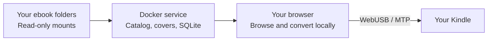

<p align="center">
  
</p>

<h1 align="center">ShelfSend</h1>

<p align="center">
  <strong>From your browser to your e-reader.</strong><br>
  Your household ebook library, self-hosted. Browse, organize, and send books to your Kindle over USB.
</p>

<p align="center">
  
  
  
  
</p>

<p align="center">
  <a href="#features">Features</a> ·
  <a href="#quick-start">Quick start</a> ·
  <a href="#send-to-kindle">Send to Kindle</a> ·
  <a href="#compatibility">Compatibility</a> ·
  <a href="#documentation">Documentation</a>
</p>

---

ShelfSend turns folders of ebooks into a searchable library with covers, household profiles, shelves, and a **Send later** queue. Connect a Kindle to your computer, see which books are already on it, and send eligible titles straight from the browser.

A small Docker service indexes your existing files. EPUB conversion and Kindle USB transfer happen locally in your browser. Your originals stay untouched, with no Calibre installation, cloud conversion, or cloud book storage required.

> [!NOTE]
> **Formerly Kindle Bridge.** ShelfSend is the new display name; existing `kindle-bridge` container names, settings, volumes, and device identifiers remain compatible. Kindle USB transfer is the currently supported reader workflow.

<a id="features"></a>
## ✨ Features

| | What you can do |
| --- | --- |
| 📚 **Browse your library** | Explore cover grids or compact lists, search and filter metadata, and switch between system light and dark themes. |
| 🏠 **Organize your household** | Create profiles over one or more library folders, browse series, build smart shelves, and mark favorites or books you want to read. |
| 🔄 **Keep the catalog current** | Watch folders for changes, run scheduled reconciliation, and review source health and indexing activity. |
| 🔌 **Connect your Kindle** | Compare live device inventory with the selected library. Green checks identify strong matches; uncertain matches remain visible. |
| 📤 **Send one book or a batch** | Convert EPUBs in the browser, transfer over USB, and follow per-book progress and verification. Queue titles with **Send later**. |
| 🎨 **Edit metadata and covers** | Save corrections, upload or paste covers, and review provider suggestions while preserving the original files. |
| 🛠️ **Manage Kindle copies** | Update an eligible edited EPUB using a verified upload before removing its old copy, or explicitly confirm removal of exact matched copies. |
| 🔎 **Resolve library issues** | Review missing metadata, source problems, duplicate choices, and resumable metadata lookup jobs in **Needs attention**. |

<a id="quick-start"></a>
## 🚀 Quick start

You need **Docker with Docker Compose**, a folder of DRM-free EPUB or supported AZW3 files, and a **WebUSB-capable Chromium desktop browser** for Kindle transfer.

### 1. Start the library

From a checkout of this repository, point Compose at your existing book folder:

```sh
KINDLE_BRIDGE_LIBRARY_HOST_PATH=/path/to/your/books docker compose up --build -d
```

Or use the default `./library` folder:

```sh
mkdir -p library
# Place your ebooks in the library folder.
docker compose up --build -d
```

Open **[http://127.0.0.1:8080](http://127.0.0.1:8080/)** on the Docker host.

### 2. Set up your household library

Follow the first-run wizard to create a profile, choose **`/libraries`** as its folder, and check indexing. You can connect your Kindle during setup or skip that step and return later. Reopen the wizard from **Settings → Run setup wizard**.

Settings uses paths **inside the container**. If your host folder is mounted at `/libraries`, enter `/libraries` or a subfolder such as `/libraries/fiction`—never the host path or an SMB URL.

### 3. Browse and send

Once indexing finishes, browse your covers, organize shelves, or queue books with **Send later**. Connect a Kindle when you are ready to transfer.

> [!IMPORTANT]
> The default deployment listens on loopback and has no built-in login. For another computer on your LAN/VPN, configure a private HTTPS origin trusted by that browser using the [deployment guide](deploy/docker/README.md). Profiles organize books; they do not restrict access. Remote WebUSB requires HTTPS.

<a id="send-to-kindle"></a>
## 🔌 Send to Kindle

1. **Connect.** Plug the Kindle into your computer and click **Connect Kindle** to open the browser's device chooser.
2. **Check.** ShelfSend automatically runs an exact-byte write/read/delete self-test, reads the device inventory, and compares it with your selected library before enabling Send.
3. **Choose.** Send an eligible missing book, select multiple titles in list view, or review your **Send later** queue.
4. **Transfer.** The browser validates the source, converts EPUBs locally, prepares the Kindle copy, and uploads and verifies each book. Batch progress identifies completed titles and keeps unsent titles selected after a failure.
5. **Read.** Open the transferred title on your Kindle. Prepared sideloads use personal-document metadata so embedded covers can appear in the library; Kindle classifies them under **Documents**.

<details>
<summary><strong>Updating and removing Kindle copies</strong></summary>

Use the book's three-dot menu to open **Edit metadata & cover**. Corrections are stored separately from the source. For an edited EPUB with one freshly confirmed stale ShelfSend-managed copy, **Update Kindle copy** uploads and verifies the replacement, durably records it, then revalidates and deletes only the exact old copy. The device needs enough temporary room for both files; ShelfSend never switches to delete-first replacement.

**Remove from Kindle** shows the exact filenames and sizes and requires confirmation. Each selected object is revalidated before deletion. Possible or fuzzy matches do not authorize removal, and host library originals remain unchanged.

See the [complete workflow and safety rules](docs/technical-guide.md#kindle-workflow-and-safety) for recovery, matching, cache behavior, and session handling.

</details>

<a id="compatibility"></a>
## 📖 Compatibility

| Area | Current support |
| --- | --- |
| **EPUB** | Preferred source format. Converted to AZW3 locally with the bundled boko WebAssembly converter. |
| **AZW3** | Uncompressed or PalmDOC-compressed KF8 sources. HUFF/CDIC compression and embedding edited AZW3 metadata/covers are unsupported. |
| **DRM** | DRM-protected ebooks are unsupported. |
| **File size** | Source downloads are limited to 200 MiB; conversion also enforces bounded resource limits. |
| **Kindle** | Browser-local WebUSB/MTP. The original transfer engine was physically tested on an MTP Kindle with USB IDs `0x1949 / 0x9981`. |
| **Other e-readers** | Future possibility; no current compatibility claim. |
| **KFX / AZW8 inventory** | Visible device presence with incomplete metadata. Experimental metadata enrichment remains disabled by default. |
| **Reading information** | Read-only recorded activity is available in book details. Automatic reading percentage and Read/Unread detection remain disabled. |

> [!NOTE]
> **Validation status:** the original physical Kindle test confirmed conversion, transfer, opening, chapter navigation, and cover display. The expanded catalog, queue, update, removal, and reconnect flow still needs fresh physical acceptance, along with the real household mounts and intended private HTTPS origin. Automated checks do not establish those results.

<details>
<summary><strong>About reading data and the Read books shelf</strong></summary>

Open a book's details to inspect **Kindle reading data** for a confirmed copy, including available recorded time, counted words, saved positions, and timestamps. Observations remain in the browser session; last-seen data is labelled, and no durable device reading history is promised.

The **Read books** shelf stores durable per-profile completion membership. Recorded timer activity does not establish completion and never automatically adds membership. Automatic reading status remains disabled because physical comparison showed that timer fractions do not match the Kindle's displayed percentage or Read status.

See [reading information and limitations](docs/technical-guide.md#reading-information-and-read-books).

</details>

## ⚙️ Configuration and storage

Use **Settings** to manage profiles, library folders, and optional metadata providers. Open Library and local cover upload/paste need no API key. A Google Books key can be added and tested in Settings; credentials stay in durable server storage and are never returned unmasked or persisted in the browser. Provider results are reviewed before becoming metadata overlays.

| Container path | Purpose | Storage |
| --- | --- | --- |
| `/libraries` | Your original ebooks | Read-only host mount; defaults to `./library` |
| `/data` | SQLite state, settings, queues, annotations, metadata overrides, and replacement covers | Persistent `kindle-bridge-data` volume |
| `/cache` | Rebuildable index/cover cache files | `kindle-bridge-cache` volume |

The Docker host makes local or NAS-backed folders available through ordinary mounts. ShelfSend does not mount SMB/NFS shares or receive their credentials. Add more read-only mounts in Compose if folders cannot share one mounted parent, and keep configured roots beneath `CATALOG_ALLOWED_ROOTS`.

<details>
<summary><strong>Common deployment settings</strong></summary>

| Setting | Purpose |
| --- | --- |
| `KINDLE_BRIDGE_LIBRARY_HOST_PATH` | Host book folder mounted at `/libraries` |
| `KINDLE_BRIDGE_HTTP_PORT` | Published port; defaults to `8080` |
| `KINDLE_BRIDGE_BIND_ADDRESS` | Bind address; defaults to `127.0.0.1` |
| `CATALOG_ALLOWED_HOSTS` | Accepted host headers for your deployment |
| `CATALOG_ALLOWED_ORIGINS` | Trusted web origins |
| `CATALOG_REQUIRE_ORIGIN` | Origin enforcement; enabled by default in Compose |
| `CATALOG_SETTINGS_MODE` | `read-write` for configuration or `read-only` to lock Settings mutations |

Use the [server configuration reference](server/README.md) for scanner, parser, concurrency, deadline, and retention controls. Follow the [Docker operations guide](deploy/docker/README.md) for HTTPS, backup, restore, rollback, and mount-loss recovery.

</details>

## 🧭 How it works



The server indexes and serves source files. The browser prepares derived copies and operates USB. Metadata edits live separately under `/data`; conversion never rewrites a mounted original. Device inventory and metadata caches stay on the browser/Kindle side and are never sent to the backend or cloud.

## 🧑‍💻 Local development

Use **Node.js 24 or newer** and npm:

```sh
npm ci
npm run dev
```

Open **[http://127.0.0.1:5173](http://127.0.0.1:5173/)**. This starts Vite on port 5173 and the catalog API on 5174, with `/api` proxied by Vite. Development state lives under `.kindle-bridge-dev/`; in Settings, use the full absolute path to `.kindle-bridge-dev/libraries` or a directory beneath it.

Run the complete validation gate:

```sh
npm run check
```

This runs the test suite, client/server TypeScript validation, and production builds. Production deployment uses the standard Docker/OCI image.

<a id="documentation"></a>
## 📚 Documentation

| Guide | Contents |
| --- | --- |
| [Technical guide](docs/technical-guide.md) | Detailed feature inventory, Kindle safety, caching, limits, and diagnostics preserved from the previous README |
| [Docker deployment](deploy/docker/README.md) | Installation, private HTTPS, storage, backups, restore, and rollback |
| [Server reference](server/README.md) | Catalog service configuration and environment variables |
| [Project handoff](PROJECT_HANDOFF.md) | Architecture decisions, implementation state, and remaining acceptance work |
| [Backlog](BACKLOG.md) | Implementation and acceptance ledger |
| [Release-candidate audit](outputs/kindle-bridge-backlog-feature-audit.md) | Requirement-by-requirement coverage and validation evidence |

## 🙏 Acknowledgements and licensing

Browser-local EPUB conversion uses **boko 0.5.0**, distributed under GPL-3.0-or-later. The required WebAssembly artifact is included in `client/vendor/boko`, with corresponding source and license material in [`third_party/boko`](third_party/boko).

Read the project [license](LICENSE) and [third-party notices](THIRD_PARTY_NOTICES.md) before redistribution.
